# Document Management Admin UI with SAP BTP
 - Using Document Management Service, Integration Option in the SAP BTP ABAP Environment

   
[Integrating SAP BTP Document Management Service UI in the Fiori App](https://community.sap.com/t5/technology-blog-posts-by-members/integrating-sap-btp-document-management-service-ui-in-the-fiori-app/ba-p/13460730)

[SAP Document Management Service](https://help.sap.com/docs/document-management-service/sap-document-management-service/what-is-document-management-service)

## 0. Setup Environments

 - Download key from Document Service

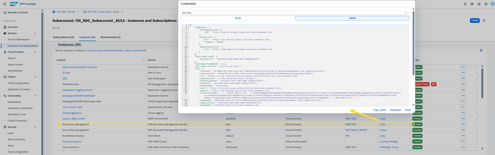

 - Add variables to Environments


``` code
Token URL uaa.url/oauth/token?grant_type=client_credentials

client secret uaa.clientsecret

clientid uaa.clientid

service url endpoints.ecmservice.url/rest/v2/repositories
``` 

## 1. Get Token

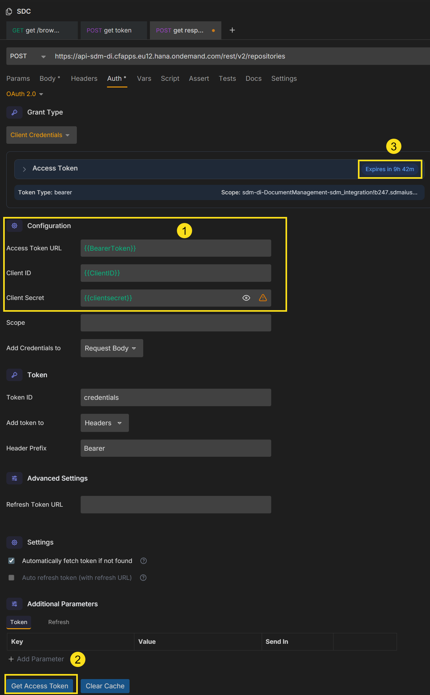

## 2. Creating a Repository

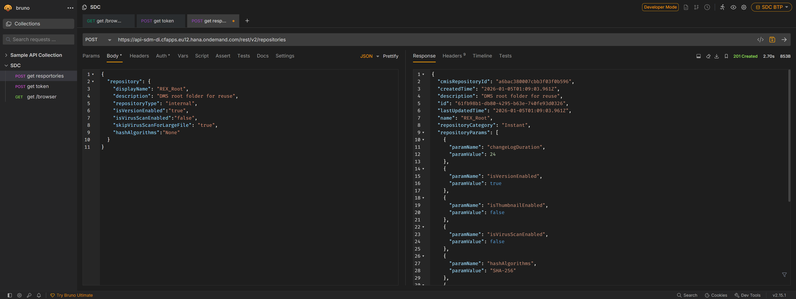

## 3. Get the Folder ID and Repository ID

 - Now replace the URL: **/rest/v2/repositories** with **/browser** and change the request type to "GET"

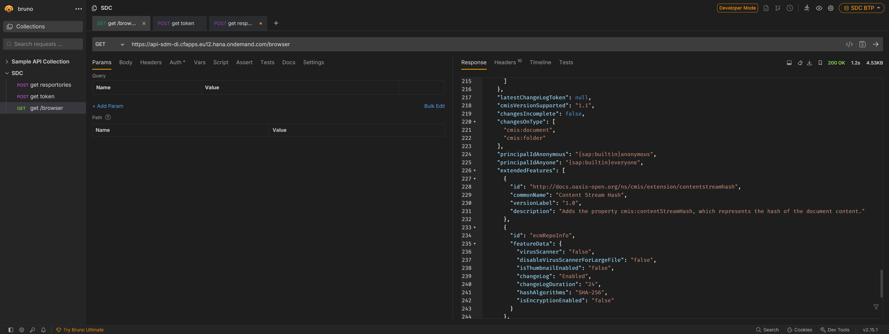

 - Save this response for further usage.

## 4. Create Application router

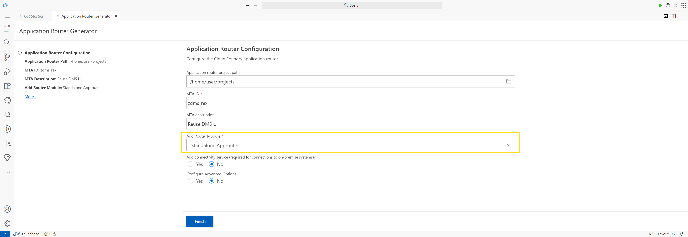

## 5. Update xs-app.json in the ui5 app

 - Find the Document Service instance name

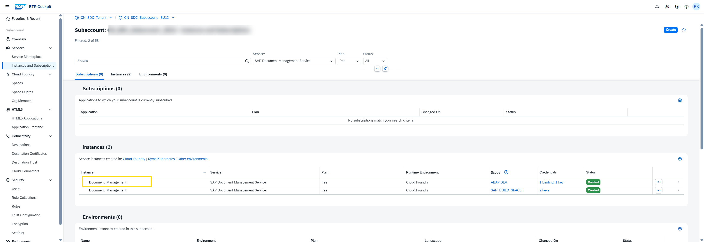

 - Update this name in **requires** and **resources**

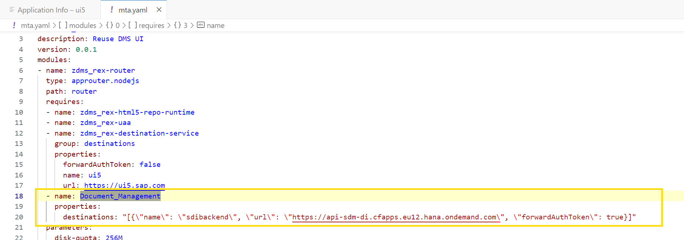

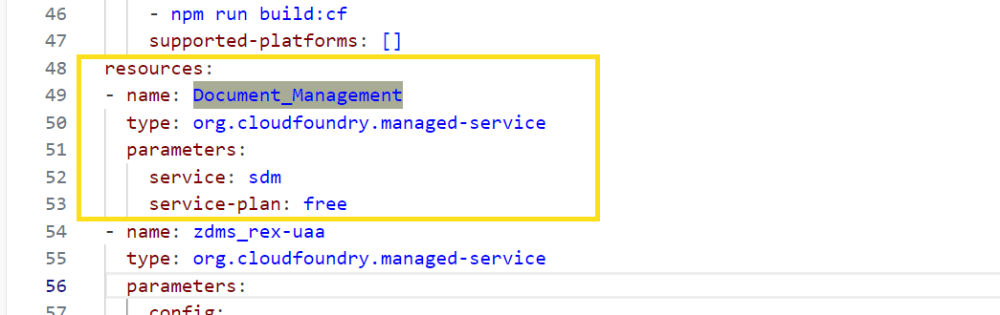

## 6. Update xs-app.json in the ui5 app

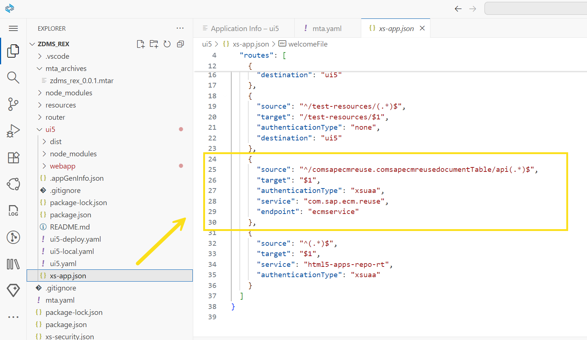

## 7. add component usage in the manifest.json of the UI5 app

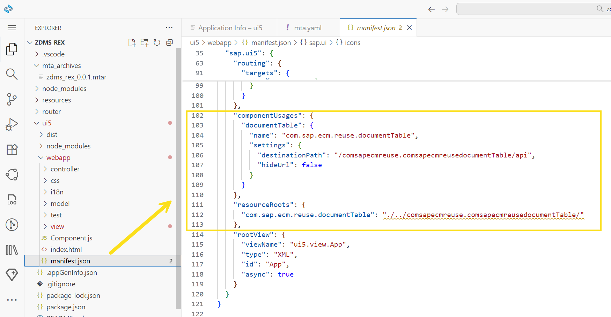

## 8. APP on BTP

 - Since this need support from BTP Service, I can’t run local test on BAS. So, I just deploy the app to cloud foundry.

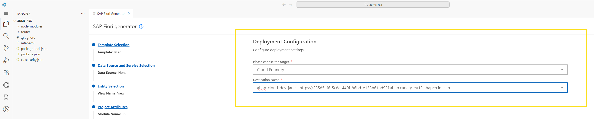

 - Initial Screen

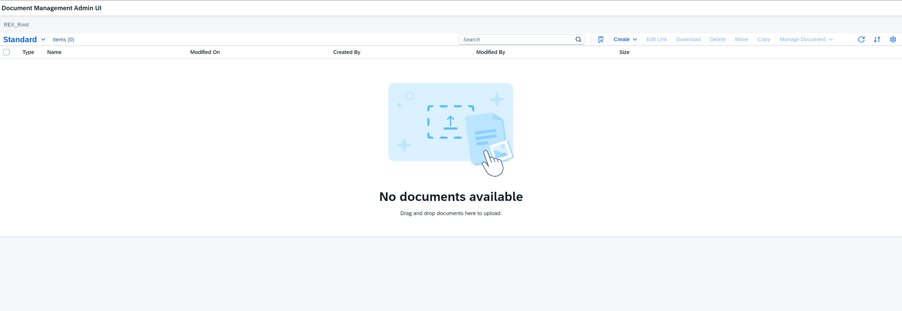

 - We can create Folder / Document / Link

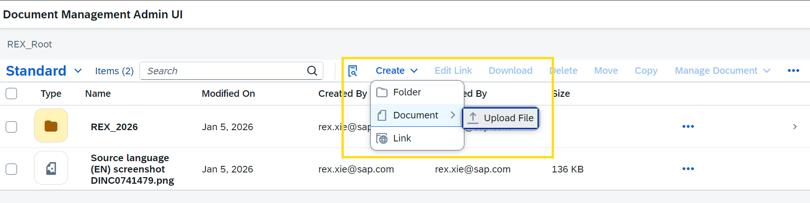

 - The upload dialog supports uploading multiple files simultaneously.

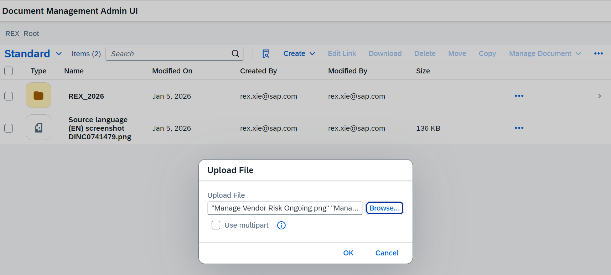

 - Provide Out-of-box in-progress bar and messages.

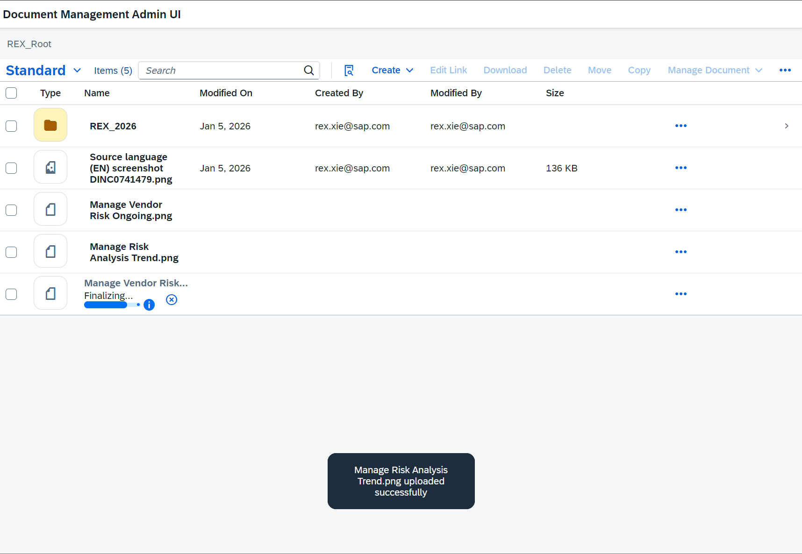

 - Provide preview and other functions for the documents.


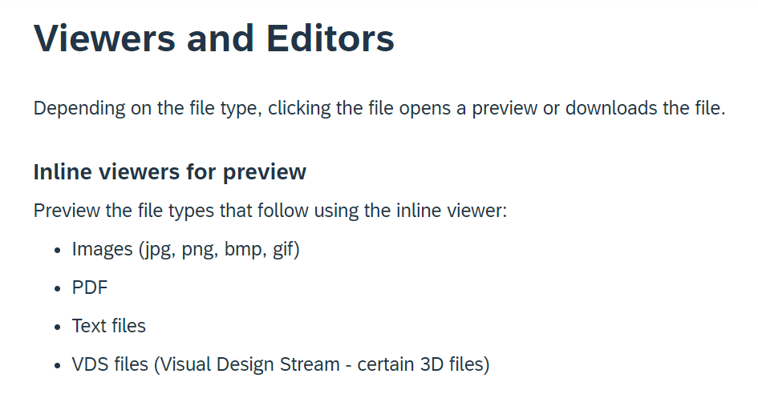

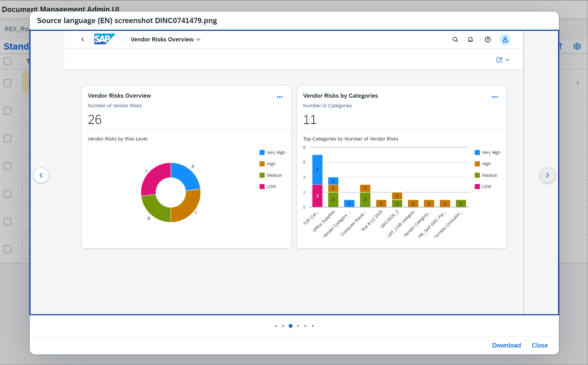

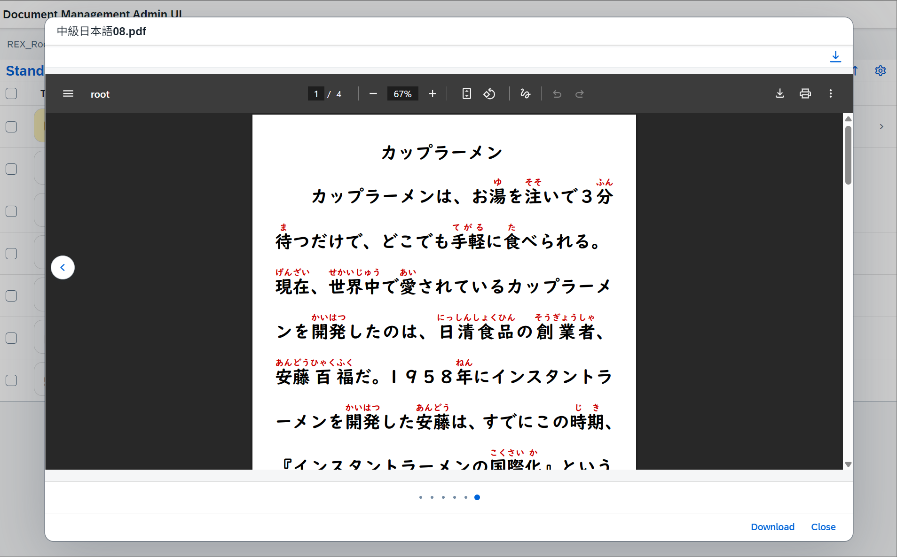
